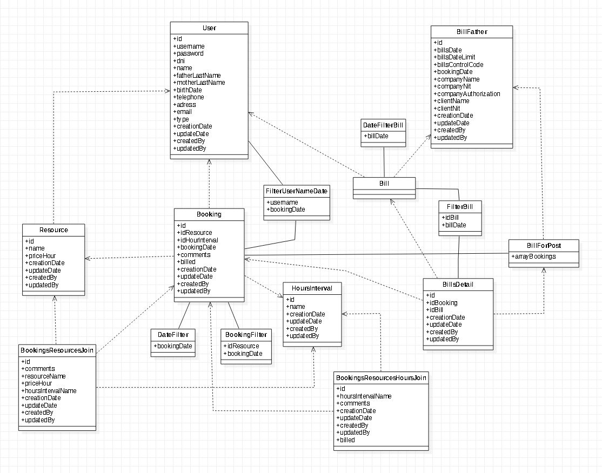
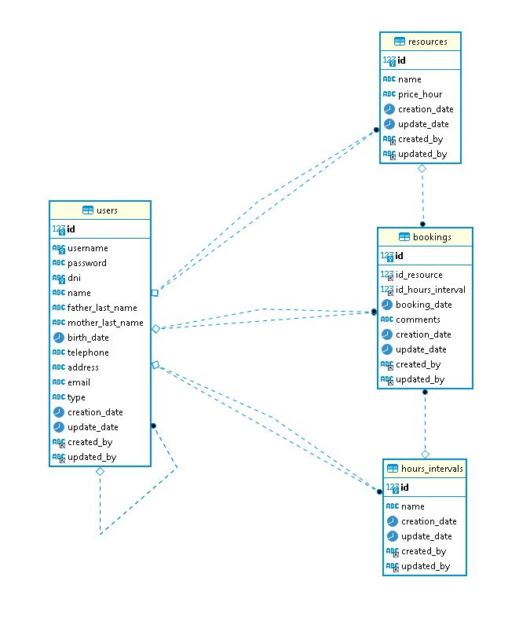

# java-spring-complejo

## Prerequisites 🔨

1. Install Windows 10
2. Install gradle-6.4.1
3. Install java 1.8.0_201
4. Install Mysql 5

### Optional install mysql db in docker

0. Docker 19.03.8

1. download docker mysql image:

```
docker pull mysql:5
```

2. start container:

```
docker run -d --name mysql -e MYSQL_ROOT_PASSWORD=secret123 -p 3306:3306 mysql:5
```

3. download docker phpmyadmin image:

```
docker pull phpmyadmin/phpmyadmin:4.8
```

4. start container:

```
docker run -d --name myadmin --link mysql:db -p 8080:80 phpmyadmin/phpmyadmin:4.8
container will start in:
http://10.31.35.100:8080/
root, secret123

```

## Deploy 🚀

### Deploy Normal

0. execute all queries from sql folder
1. gradlew build
2. configure: build/resources/main/java/com/complejo/resources/application.properties
3. java -jar build/libs/java-spring-complejo.jar

### Deploy Docker
0. execute all queries from sql folder
1. gradlew build
2. configure: build/resources/main/java/com/complejo/resources/application.properties

```
*server.address=0.0.0.0 # Bind all Docker Container 
*Mandatory: server.address=0.0.0.0
*recomended db host with ip.
```

3. create docker image

```
docker build -t java-spring-complejo:1.0 .
```

4. run container:

```
first time: docker run -d --name java-spring-complejo -p 8080:8080 java-spring-complejo:1.0
then: docker start java-spring-complejo
```

## Diagrams

### Class Diagram

<p align="center">
  
</p>

### Entity relation data base

<p align="center">
  
</p>

## Usage

### Default Token: 

```
Bearer eyJhbGciOiJIUzUxMiJ9.eyJqdGkiOiJzb2Z0dGVrSldUIiwic3ViIjoiZHZlcmExIiwiYXV0aG9yaXRpZXMiOlsiUk9MRV9VU0V
SIl0sImlhdCI6MTYwMjEyMTQzMX0.Ee_NdiR3q2HY3nrjP4YY5B5sRs8udEjsZjTDqfT9MUAp8yxWTJ1FYmZZb-F50jeIyEqmQwSXlxejuadeFlI25Q
```

### API:

#### Login:

```
POST localhost:8080/api/v1/login

{
  "username": "admin",
  "password": "admin123"
  "token": "Bearer ..."
}
```
#### Users:

```
GET localhost:8080/api/v1/users
POST localhost:8080/api/v1/users
GET localhost:8080/api/v1/users/{id}
PUT localhost:8080/api/v1/users/{id}
DELETE localhost:8080/api/v1/users/{id}

{
  "id": 1000,
  "username": "admin",
  "password": "admin123",
  "dni": "0000000",
  "name": "Admin",
  "fatherLastName": "Admin",
  "motherLastName": "Admin",
  "birthDate": "1990-01-01",
  "telephone": "76479009",
  "address": "Av. Villazon km-5",
  "email": "Admin@gmail.com",
  "type": "admin",
  "creationDate": "2020-10-16 22:46:43",
  "updateDate": null,
  "createdBy": null,
  "updatedBy": null
}
```

#### Resources:

```
GET localhost:8080/api/v1/resources
POST localhost:8080/api/v1/resources
GET localhost:8080/api/v1/resources/{id}
PUT localhost:8080/api/v1/resources/{id}
DELETE localhost:8080/api/v1/resources/{id}

{
  "id": 1000,
  "name": "cancha de basquet",
  "priceHour": 50.0,
  "creationDate": "2021-02-05 00:18:14",
  "updateDate": null,
  "createdBy": "micky",
  "updatedBy": null
}
```

#### Hours Intervals:

```
GET localhost:8080/api/v1/hours-interval
GET localhost:8080/api/v1/hours-interval/{id}


{
  "id": 1000,
  "name": "5:00-5:30",
  "creationDate": "2021-02-05 01:28:47",
  "updateDate": null,
  "createdBy": "micky",
  "updatedBy": null
}
```

#### Bookings:

```
GET localhost:8080/api/v1/bookings
POST localhost:8080/api/v1/bookings
GET localhost:8080/api/v1/bookings/{id}
PUT localhost:8080/api/v1/bookings/{id}
DELETE localhost:8080/api/v1/bookings/{id}

{
  "id": 1000,
  "idResource": 1000,
  "idHoursInterval": 1000,
  "bookingDate": "2021-01-03",
  "comments": "Reserving from Micky",
  "creationDate": "2021-02-05 01:59:02",
  "updateDate": null,
  "createdBy": "micky",
  "updatedBy": null
}
```

#### Avaliable Hours:

```
POST localhost:8080/api/v1/hours-interval/filter-avaliable

{
  "id": 1000,
  "name": "5:00-5:30",
  "creationDate": "2021-02-05 01:28:47",
  "updateDate": null,
  "createdBy": "micky",
  "updatedBy": null
}
```

#### Reserved Hours:

```
POST localhost:8080/api/v1/hours-interval/filter-reserved

{
  "id": 1069,
  "name": "16:30-17:00",
  "creationDate": "2021-02-05 02:11:45",
  "updateDate": null,
  "createdBy": "micky",
  "updatedBy": null
}
```

## Contributing

1. Fork it!
2. Create your feature branch: `git checkout -b feature/1001`
3. Commit your changes: `git commit -m 'feature/1001: Add some feature'`
4. Push to the branch: `git push origin feature/1001`
5. Submit a pull request.

## License

- Free.
